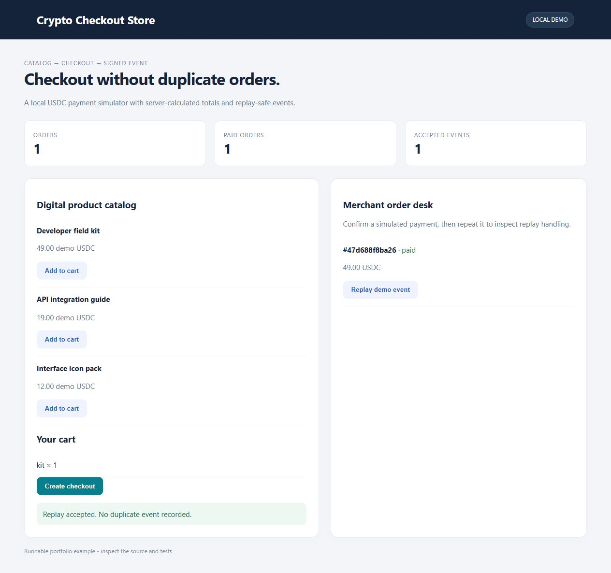

# Crypto Checkout Store

A small product store with an idempotent order flow and signed payment notifications.



## Run

Python 3.12+:
```sh
python -m venv .venv
# Windows: .venv\Scripts\activate
# macOS/Linux: source .venv/bin/activate
python -m pip install -r requirements.txt
python server.py
```
Open http://127.0.0.1:8765. `PORT` selects another port; `DATA_DB` selects a SQLite file.

## Test
```sh
python -m unittest -v test_engine
```

## Payment adapter
The default provider is a **local USDC payment simulator**. It does not generate blockchain addresses or transfer money. Checkout totals are calculated on the server from catalog prices in integer cents. A unique checkout key prevents duplicate orders and rejects reuse with a different cart.

Payment events use HMAC-SHA256 over the exact UTF-8 JSON body. The handler validates the order, currency and amount before recording the event and moving the order to paid in one transaction. Replays return the prior result. Reusing an event ID with a different payload is rejected. `WEBHOOK_SECRET` configures the secret; the local simulator uses a random process secret when unset. The simulator can deliberately replay an event to exercise deduplication.

`engine.apply_webhook(body, signature)` is the provider-adapter seam. A production adapter needs an externally reachable authenticated endpoint, provider-specific signature verification, chain confirmation and expiry policy. No real payment provider is configured in this sample.


## Scope
Local single-user portfolio demonstration, bound to loopback. The dashboard has no account authentication and is not a public deployment. SQLite databases, environment secrets and generated files are ignored. Demo actions are clearly labeled. Tests use isolated database files and mock external transports.
